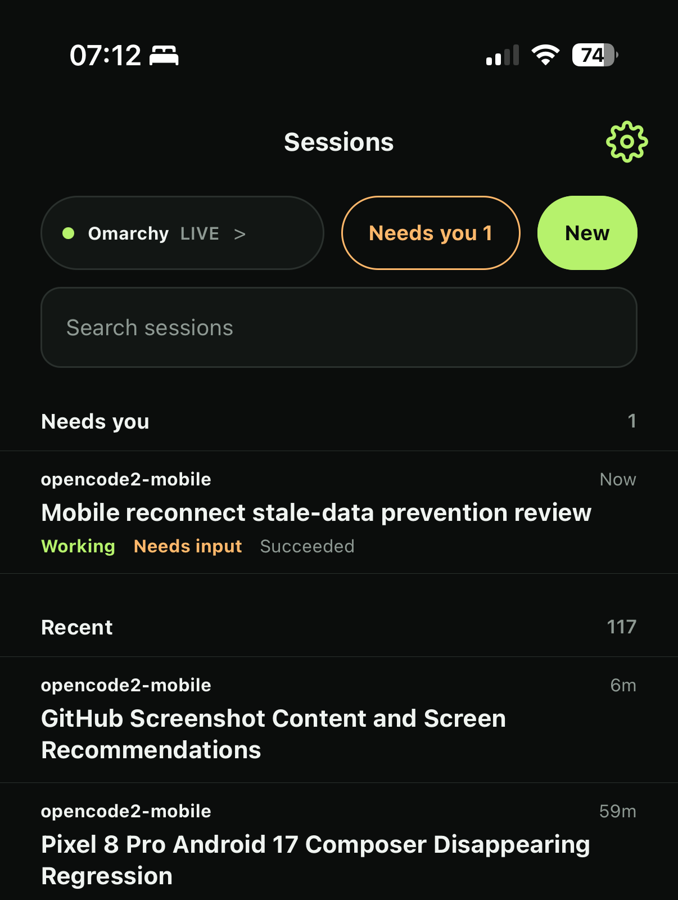
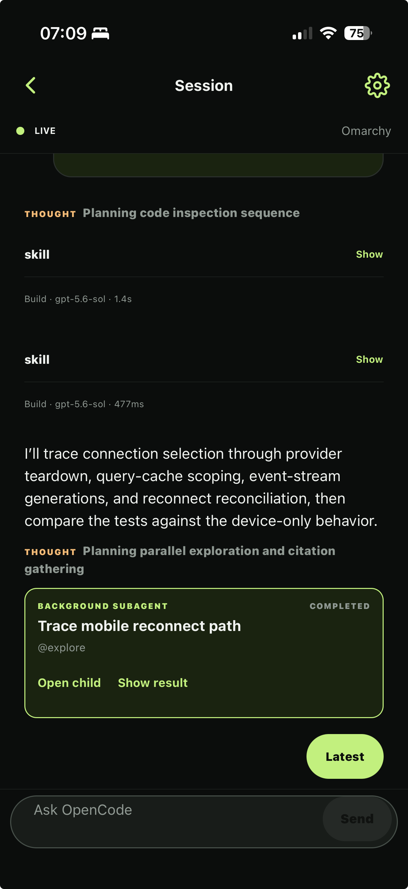
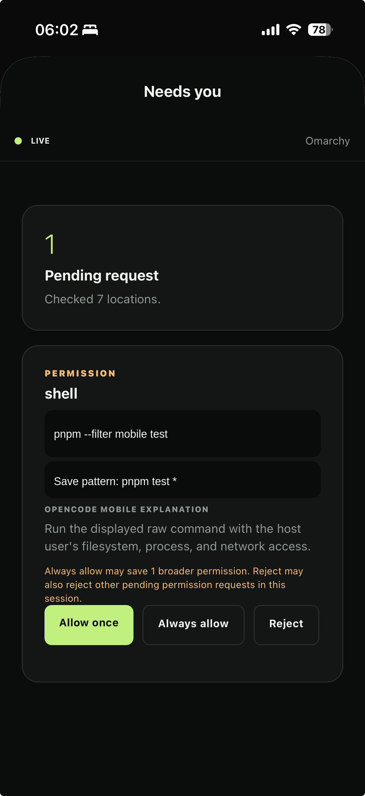
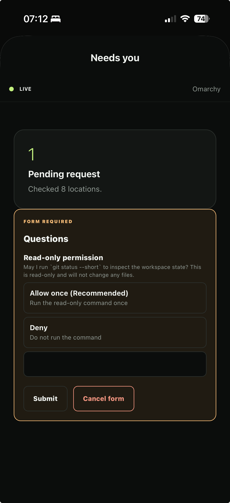

# opencode2-mobile

A native Expo client for the OpenCode V2 HTTP API. The app runs on iOS and
Android and connects directly to a user-configured OpenCode server. OpenCode V1
is out of scope.

opencode2-mobile is an independent mobile client for OpenCode. It is not built by or
affiliated with the OpenCode team or Anomaly.

## Mobile workflow

Keep track of active and blocked sessions across followed projects.

<p align="center">
  
</p>

<table>
  <tr>
    <td width="33%" valign="top">
      
      <br>Coordinate parent and child agent work.
    </td>
    <td width="33%" valign="top">
      
      <br>Handle blocked permissions from the phone.
    </td>
    <td width="33%" valign="top">
      
      <br>Answer structured forms without returning to the terminal.
    </td>
  </tr>
</table>

## Project documents

- [Specification](docs/SPEC.md)
- [Deployment configuration](docs/CONFIGURATION.md)
- [Self-hosted push notifications](docs/NOTIFICATIONS.md)
- [Enable server push with an agent](docs/PUSH_AGENT_RUNBOOK.md)
- [Implementation TODO](TODO.md)

## Architecture

`apps/mobile` contains the Expo application. `packages/opencode-adapter` is the
only package that imports `@opencode-ai/client`; it never imports the Node-only
service entrypoint. The phone connects directly to OpenCode over HTTPS or
explicitly approved private-network HTTP.

Optional remote attention uses a separate V2 plugin and self-hosted notification
broker. The broker is not an OpenCode proxy. Its local pairing CLI or the
same-host OpenCode `/pair` flow accepts the OpenCode credential long enough to
create an encrypted, short-lived bootstrap challenge. Normal notification
processing never uses the credential. See the notification setup document for
the signed-build workflow and pairing trust model.

The app supports saved connections, followed projects, session management,
paginated transcripts, text prompts, permission and form responses, encrypted
drafts, and optional self-hosted permission, form, and session-completion
notifications. It stores Basic or Bearer
credentials only in SecureStore. `TODO.md` tracks the remaining product and
device-verification work.

## Development

Use Node.js 26.7.0 (`fnm use`, `nvm use`, or another version manager) and pnpm
11.21.0. Node 26 does not bundle Corepack, so install the pinned pnpm release if
it is not already available:

```sh
npm install --global pnpm@11.21.0
pnpm install --frozen-lockfile
pnpm go
```

A clean clone uses generic native identifiers and does not require an Expo or
Firebase account. Copy `apps/mobile/config/deployment.example.json` to the
ignored `apps/mobile/config/local/deployment.json` before creating a
deployment-specific signed build. See
[deployment configuration](docs/CONFIGURATION.md) for EAS, Firebase, APNs, and
FCM setup. Never store credentials in Expo app configuration.

`pnpm go` starts Expo Go for devices on the same LAN. `pnpm dev` instead
advertises this machine's Tailscale address and requires an installed,
authenticated Tailscale CLI. Scan either QR code with the App Store Expo Go app.

The project uses SDK 54 so it opens in the Expo Go build currently distributed
through Apple's App Store. `pnpm dev:client` starts Metro for an installed
development build. Generate and launch native projects with `pnpm android` when
the Android SDK and JDK are installed or, on macOS with Xcode and CocoaPods,
`pnpm ios`. Expo config plugins own the ignored `android` and `ios` directories.

## Preview distribution

The `preview` EAS profile produces standalone release-mode builds for device
testing. These builds use the `preview` EAS Update channel and do not need Metro.
Configure your own EAS project first, then run EAS commands from the app
directory:

```sh
pnpm check
pnpm native:doctor
cd apps/mobile
pnpm dlx eas-cli@22.4.0 whoami
```

Build an installable APK for Android with:

```sh
pnpm dlx eas-cli@22.4.0 build --platform android --profile preview
```

Open the resulting EAS build URL on the Android device. Android may ask the user
to allow the browser to install apps from unknown sources.

An iPhone must be registered before its first ad hoc build. This requires Apple
Developer Program access:

```sh
pnpm dlx eas-cli@22.4.0 device:create
pnpm dlx eas-cli@22.4.0 build --platform ios --profile preview
```

Choose your Expo account and Apple team during device registration. Use the
website registration method and open its URL on the iPhone. During the build,
you may let EAS manage the distribution certificate and ad hoc provisioning
profile, and include the registered iPhone.

Install the app from the resulting EAS build URL. On iOS, enable **Developer
Mode** under **Settings > Privacy & Security**, restart the phone, and confirm
the setting before launching OpenCode2 Mobile. Registering another iPhone requires a new
build or a re-signed build whose provisioning profile includes that device.

Your EAS project dashboard lists its builds and installation links.

## Preview updates

EAS Update handles JavaScript, styling, and bundled asset changes without a new
native build. Validate the repository, then publish to the channel used by the
installed preview builds:

```sh
pnpm check
cd apps/mobile
pnpm dlx eas-cli@22.4.0 update --channel preview --environment preview \
  --message "Describe the update"
```

The installed app downloads an available update when it launches and normally
applies it after the next restart. Expo SDK changes, native dependency changes,
config plugin changes, permissions, icons, and other native configuration still
require new Android and iOS builds. Increment the app version in `app.config.ts`
before such a build so the `appVersion` runtime policy cannot send incompatible
updates to an older binary.

Run the complete repository checks with:

```sh
pnpm check
pnpm native:doctor
```

The connection form accepts an origin such as `https://host.example:4096`.
Cleartext Tailscale or LAN HTTP requires explicit approval in the app. Never put
credentials in source files, environment files, URLs, or command history.

## References

- [OpenCode 2 documentation](https://opencode.ai/v2/docs/)
- [OpenCode 2 API](https://opencode.ai/v2/docs/api)
- [OpenCode 2 client](https://opencode.ai/v2/docs/build/client)
- [OpenAPI document](https://opencode.ai/v2/openapi.json)

OpenCode 2 and its client are currently beta. API and client contracts may
change before the stable release.

## License

opencode2-mobile is available under the [MIT license](LICENSE). Dependencies and bundled
data retain their own licenses; see [third-party software](THIRD_PARTY_NOTICES.md).
